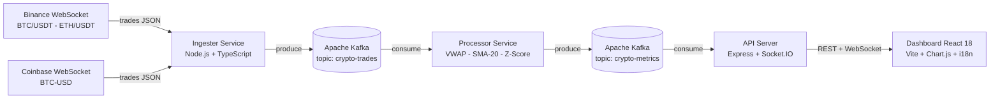

# Crypto Market Monitor

Surveillance temps reel des marches crypto - pipeline Kafka avec dashboard React live.

<!-- adam-badges:start -->
[](https://github.com/Adam-Blf/crypto-market-monitor/commits)
[](https://hits.sh/github.com/Adam-Blf/crypto-market-monitor/)
[](https://github.com/Adam-Blf/crypto-market-monitor/commits)
[](https://github.com/Adam-Blf/crypto-market-monitor)
[](LICENSE)
<!-- adam-badges:end -->

[](https://kafka.apache.org/)
[](https://react.dev/)
[](https://nodejs.org/)
[](https://www.typescriptlang.org/)
[](https://www.docker.com/)
[](https://socket.io/)
[](https://vitejs.dev/)

---

## Presentation

Pipeline de streaming bout-en-bout qui ingere les transactions crypto en direct depuis les flux WebSocket de Binance et Coinbase, les traite via Apache Kafka, calcule des metriques analytiques en temps reel (VWAP, SMA-20, detection d'anomalies par z-score) et pousse les resultats vers un dashboard **React 18 + TypeScript** live via Socket.IO.

Realise en binome dans le cadre du module **Real-Time Engineering** - M1 Data Engineering & IA, EFREI Paris (2025-2026).
Projet realise a **2 personnes** malgre une consigne prevue pour 4.

---
## Auteurs

**Adam Beloucif** ([@Adam-Blf](https://github.com/Adam-Blf)) · **Emilien Morice** ([@emilien754](https://github.com/emilien754))

M1 Data Engineering & IA, EFREI Paris - Module Real-Time Engineering (2025-2026)

## Architecture
---



### Description des composants

| Service | Role | Technologies |
|---------|------|--------------|
| **Ingester** | Clients WebSocket Binance + Coinbase, normalisation, production Kafka | Node.js, TypeScript, `ws`, `kafkajs` |
| **Kafka** | Tampon de decoupling, tolerant aux pannes, multi-consommateurs | Apache Kafka 3.7 KRaft (sans Zookeeper) |
| **Processor** | Consomme les transactions, calcule VWAP, SMA-20, volume, z-score | Node.js, TypeScript, `kafkajs` |
| **API** | Agregation metriques, endpoints REST, push temps reel | Express, Socket.IO, helmet, rate-limit |
| **Dashboard** | SPA React 18 + TS, graphiques Chart.js, i18n FR/EN, servi Node.js | React 18, TypeScript, Vite, react-chartjs-2, Express |

---

## Fonctionnalites

- Ingestion en direct depuis **Binance** (BTC/USDT, ETH/USDT) et **Coinbase** (BTC-USD) via WebSocket
- **Apache Kafka** comme backbone de streaming central en mode KRaft (sans Zookeeper)
- Metriques analytiques calculees par fenetre glissante :
  - VWAP (Volume Weighted Average Price) - 1 minute
  - SMA-20 (Moyenne Mobile Simple sur les 20 derniers trades)
  - Volume cumule par minute + nombre de transactions
  - Detection d'anomalies par z-score (seuil configurable, defaut 2.5 sigma)
  - Variation de prix 1min et 5min
- API REST : `GET /api/health`, `/api/metrics`, `/api/metrics/:symbol`, `/api/history/:symbol`, `/api/anomalies`
- Push WebSocket temps reel via Socket.IO (pas de polling)
- **Dashboard React 18 + TypeScript** : 8 composants, hooks Socket.IO, Chart.js, animations flash prix
- **Mode demo** : active automatiquement apres 3s si le backend est inaccessible (donnees simulees)
- **Multilingue FR/EN** avec bascule instantanee et persistance localStorage
- Securite : helmet, express-rate-limit, validation zod, CORS strict, conteneurs non-root
- Kafka UI disponible sur le port 8090

---

## Demarrage rapide

### Option 1 - Lanceur Python universel (recommande)

```bash
git clone https://github.com/Adam-Blf/crypto-market-monitor.git
cd crypto-market-monitor
python start.py
```

Lance Docker Compose, attend les healthchecks, ouvre le navigateur automatiquement.

```bash
python start.py --stop    # arreter la stack
python start.py --logs    # logs en direct
python start.py --reset   # reset complet avec volumes
```

Dependances optionnelles (meilleure UI) : `pip install rich requests`

### Option 2 - Lanceur Node.js (compile en .exe)

```bash
git clone https://github.com/Adam-Blf/crypto-market-monitor.git
cd crypto-market-monitor
node launcher/src/index.mjs
```

Compiler en executable standalone :

```bash
cd launcher && npm install && npm run build:win    # Windows .exe
cd launcher && npm install && npm run build:linux  # Linux binaire
```

### Option 3 - Docker Compose direct

```bash
git clone https://github.com/Adam-Blf/crypto-market-monitor.git
cd crypto-market-monitor
cp .env.example .env
docker-compose up --build -d
docker-compose logs -f
```

Acces :
- Dashboard React : http://localhost:8080
- Kafka UI : http://localhost:8090
- API health : http://localhost:3001/api/health

### Option 4 - Image Docker tout-en-un

```bash
docker build -f all-in-one.Dockerfile -t crypto-monitor .
docker run -d -p 8080:8080 -p 3001:3001 --name cmm crypto-monitor
docker stop cmm && docker rm cmm
```

### Option 5 - Developpement local (sans Docker)

**Dashboard React :**
```bash
cd dashboard-react
npm install
npm run dev   # http://localhost:8080 (mode demo si API absente)
```

**Services backend (necessite Kafka actif) :**
```bash
npm install
npm run dev:ingester   # terminal 1
npm run dev:processor  # terminal 2
npm run dev:api        # terminal 3
```

---

## Structure du projet

```
crypto-market-monitor/
- ingester/              Clients WebSocket Binance + Coinbase - Producteur Kafka
- processor/             Consommateur Kafka - moteur analytique (VWAP, SMA-20, z-score)
- api/                   Serveur REST Express + push WebSocket Socket.IO
- dashboard-react/       Dashboard SPA React 18 + TypeScript + Vite
  - src/components/      8 composants React (Header, HeroCard, Charts, AnomalyFeed...)
  - src/hooks/           useSocket.ts (Socket.IO + demo mode), useClock.ts
  - src/i18n.ts          Context i18n FR/EN
  - server.cjs           Express Node.js pour servir le build en production
  - Dockerfile           Multi-stage: node build + node serve (pas nginx)
- launcher/              Lanceur Node.js - compile en .exe via pkg
- start.py               Lanceur Python universel (Docker + health + browser)
- launch_demo.pyw        Wrapper silent pour bouton PPT demo
- scripts/               Configuration supervisord, script init Kafka
- docker-compose.yml     Orchestration 6 services
- all-in-one.Dockerfile  Image tout-en-un (Kafka + tous les services)
- docs/
  - ARCHITECTURE.md      Decisions techniques et flux de donnees
  - presentation/        Presentation PowerPoint EFREI (13 slides, bouton demo)
  - report/              Rapport technique PDF (Playwright HTML-to-PDF)
- .env.example           Template des variables d'environnement
- SECURITY.md            Politique de securite et checklist
```

---

## Variables d'environnement

Voir `.env.example` pour la liste complete. Variables cles :

| Variable | Defaut | Description |
|----------|--------|-------------|
| `KAFKA_BROKERS` | `localhost:9092` | Serveurs bootstrap Kafka |
| `KAFKA_TOPIC_TRADES` | `crypto-trades` | Topic des transactions brutes |
| `KAFKA_TOPIC_METRICS` | `crypto-metrics` | Topic des metriques traitees |
| `API_PORT` | `3001` | Port du serveur API |
| `DASHBOARD_PORT` | `8080` | Port du dashboard React |
| `SMA_WINDOW` | `20` | Taille de la fenetre glissante SMA |
| `ANOMALY_ZSCORE_THRESHOLD` | `2.5` | Seuil z-score pour la detection d'anomalies |

---

## Algorithmes analytiques

| Metrique | Formule | Fenetre |
|----------|---------|---------|
| VWAP | `sum(prix * quantite) / sum(quantite)` | 1 minute |
| SMA-20 | `moyenne des 20 derniers prix` | 20 derniers trades |
| Anomalie | `z-score = (valeur - moyenne) / ecart-type > 2.5` | 1 minute |
| Variation 1min | `(prix_actuel - premier_prix) / premier_prix * 100` | 1 minute |
| Variation 5min | `(prix_actuel - premier_prix) / premier_prix * 100` | 5 minutes |

---

## Star History

[](https://star-history.com/#Adam-Blf/crypto-market-monitor&Date)
