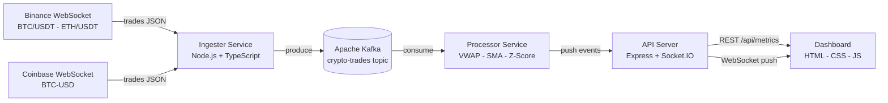

# Crypto Market Monitor

Real-time crypto market monitoring system - Kafka pipeline with live dashboard.

<!-- adam-badges:start -->
[](https://github.com/Adam-Blf/crypto-market-monitor/commits)
[](https://hits.sh/github.com/Adam-Blf/crypto-market-monitor/)
[](https://github.com/Adam-Blf/crypto-market-monitor/commits)
[](https://github.com/Adam-Blf/crypto-market-monitor)
[](LICENSE)
<!-- adam-badges:end -->

[](https://kafka.apache.org/)
[](https://nodejs.org/)
[](https://www.typescriptlang.org/)
[](https://www.docker.com/)
[](https://socket.io/)

---

## Overview

End-to-end streaming pipeline ingesting live crypto trades from Binance and Coinbase WebSocket feeds, processing them through Apache Kafka, computing real-time analytics (VWAP, SMA-20, anomaly detection via z-score), and pushing results to a live dashboard via Socket.IO.

Built as a 2-person project for the **Real-Time Engineering** module - M1 Data Engineering & IA, EFREI Paris.

---

## Architecture



### Component breakdown

| Service | Role | Tech |
|---------|------|------|
| **Ingester** | WebSocket clients for Binance + Coinbase, normalizes events, produces to Kafka | Node.js, TypeScript, `ws`, `kafkajs` |
| **Kafka** | Decoupling buffer between ingestion and processing, fault-tolerant, multi-consumer | Apache Kafka 3.7 KRaft (no Zookeeper) |
| **Processor** | Consumes trades, computes VWAP, SMA-20, cumulative volume, z-score anomalies | Node.js, TypeScript, `kafkajs` |
| **API** | Aggregates metrics, exposes REST endpoints, pushes real-time events to clients | Express, Socket.IO |
| **Dashboard** | Live price chart, volume bars, anomaly feed, multi-pair selector | HTML, CSS, JS, Chart.js |

---

## Features

- Live trade ingestion from **Binance** (BTC/USDT, ETH/USDT) and **Coinbase** (BTC-USD) WebSocket feeds
- **Apache Kafka** as the central streaming backbone in KRaft mode (no Zookeeper dependency)
- Real-time analytics computed per sliding window:
  - VWAP (Volume Weighted Average Price)
  - SMA-20 (Simple Moving Average over last 20 trades)
  - Cumulative volume per minute
  - Anomaly detection using z-score (configurable threshold)
- REST API with endpoints: `GET /api/metrics`, `GET /api/trades`, `GET /api/health`
- WebSocket push to dashboard via Socket.IO (no polling)
- Dark-themed live dashboard with Chart.js charts, anomaly alert feed, connection status
- Full Docker Compose stack with Kafka UI at port 8090

---

## Quick Start

### Option 1 - Launcher (single executable, no Node.js required)

```bash
# Clone and launch with one command
git clone https://github.com/Adam-Blf/crypto-market-monitor.git
cd crypto-market-monitor
node launcher/src/index.mjs
```

The launcher checks Docker, builds all images, waits for health checks, and opens the dashboard automatically. Press `Ctrl+C` to stop everything cleanly.

### Option 2 - All-in-one Docker image (single container)

```bash
# Build the all-in-one image (Kafka + all services + nginx)
docker build -f all-in-one.Dockerfile -t crypto-monitor .

# Run with a single command
docker run -d -p 8080:8080 -p 3001:3001 --name cmm crypto-monitor

# Stop
docker stop cmm && docker rm cmm
```

This image bundles Apache Kafka (KRaft), Ingester, Processor, API, and Dashboard in a single container managed by supervisord.

### Option 3 - Docker Compose (recommended for development)

```bash
# Clone the repo
git clone https://github.com/Adam-Blf/crypto-market-monitor.git
cd crypto-market-monitor

# Copy env template
cp .env.example .env

# Start the full stack
docker-compose up --build -d

# Check logs
docker-compose logs -f
```

### Option 4 - Local development (no Docker)

```bash
# Requires a running Kafka instance (see docker-compose for Kafka only)
npm install
npm run dev:ingester   # terminal 1
npm run dev:processor  # terminal 2
npm run dev:api        # terminal 3
# open dashboard/index.html in browser (demo mode activates if no backend)
```

Open:
- Dashboard: http://localhost:8080
- Kafka UI: http://localhost:8090 (Docker Compose only)
- API health: http://localhost:3001/api/health

---

## Project Structure

```
crypto-market-monitor/
- ingester/              WebSocket clients - Binance + Coinbase - Kafka producer
- processor/             Kafka consumer - analytics engine (VWAP, SMA, z-score)
- api/                   Express REST + Socket.IO push layer
- dashboard/             Static HTML/CSS/JS live dashboard (FR/EN i18n, demo mode)
- launcher/              Standalone launcher - compiled to .exe via pkg
- scripts/               Supervisord config, Kafka init script
- docker-compose.yml     Multi-container orchestration
- all-in-one.Dockerfile  Single-container image (Kafka + all services)
- .env.example           Environment template
```

---

## Environment Variables

See `.env.example` for the full list. Key variables:

| Variable | Default | Description |
|----------|---------|-------------|
| `KAFKA_BROKERS` | `localhost:9092` | Kafka bootstrap servers |
| `KAFKA_TOPIC_TRADES` | `crypto-trades` | Raw trades topic |
| `KAFKA_TOPIC_METRICS` | `crypto-metrics` | Processed metrics topic |
| `API_PORT` | `3001` | API server port |
| `SMA_WINDOW` | `20` | SMA sliding window size |
| `ANOMALY_ZSCORE_THRESHOLD` | `2.5` | Z-score threshold for anomaly detection |

---

## Star History

[](https://star-history.com/#Adam-Blf/crypto-market-monitor&Date)

---

## Authors

Adam Beloucif, Emilien Morice - M1 Data Engineering & IA, EFREI Paris - Real-Time Engineering module (2025-2026)
