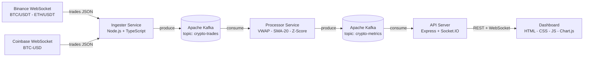

# Crypto Market Monitor

Systeme de surveillance des marches crypto en temps reel - pipeline Kafka avec dashboard live.

<!-- adam-badges:start -->
[](https://github.com/Adam-Blf/crypto-market-monitor/commits)
[](https://hits.sh/github.com/Adam-Blf/crypto-market-monitor/)
[](https://github.com/Adam-Blf/crypto-market-monitor/commits)
[](https://github.com/Adam-Blf/crypto-market-monitor)
[](LICENSE)
<!-- adam-badges:end -->

[](https://kafka.apache.org/)
[](https://nodejs.org/)
[](https://www.typescriptlang.org/)
[](https://www.docker.com/)
[](https://socket.io/)
[](dashboard/i18n/)

---

## Presentation

Pipeline de streaming bout-en-bout qui ingere les transactions crypto en direct depuis les flux WebSocket de Binance et Coinbase, les traite via Apache Kafka, calcule des metriques analytiques en temps reel (VWAP, SMA-20, detection d'anomalies par z-score) et pousse les resultats vers un dashboard live via Socket.IO.

Realise en binome dans le cadre du module **Real-Time Engineering** - M1 Data Engineering & IA, EFREI Paris (2025-2026).
Projet realise a **2 personnes** malgre une consigne prevue pour 4.

---

## Architecture



### Description des composants

| Service | Role | Technologies |
|---------|------|--------------|
| **Ingester** | Clients WebSocket Binance + Coinbase, normalisation des evenements, production vers Kafka | Node.js, TypeScript, `ws`, `kafkajs` |
| **Kafka** | Tampon de decoupling entre ingestion et traitement, tolerant aux pannes, multi-consommateurs | Apache Kafka 3.7 KRaft (sans Zookeeper) |
| **Processor** | Consomme les transactions, calcule VWAP, SMA-20, volume, anomalies z-score | Node.js, TypeScript, `kafkajs` |
| **API** | Agregation des metriques, endpoints REST, push temps reel vers les clients | Express, Socket.IO, helmet, rate-limit |
| **Dashboard** | Graphique de prix en direct, barres de volume, flux d'anomalies, selecteur de paires | HTML, CSS, JS, Chart.js, i18n FR/EN |

---

## Fonctionnalites

- Ingestion en direct depuis **Binance** (BTC/USDT, ETH/USDT) et **Coinbase** (BTC-USD) via WebSocket
- **Apache Kafka** comme backbone de streaming central en mode KRaft (sans Zookeeper)
- Metriques analytiques calculees par fenetre glissante :
  - VWAP (Volume Weighted Average Price) - 1 minute
  - SMA-20 (Moyenne Mobile Simple sur les 20 derniers trades)
  - Volume cumule par minute + nombre de transactions
  - Detection d'anomalies par z-score (seuil configurable, defaut 2.5 sigma)
  - Variation de prix 1min et 5min
- API REST : `GET /api/health`, `/api/metrics`, `/api/metrics/:symbol`, `/api/history/:symbol`, `/api/anomalies`
- Push WebSocket vers le dashboard via Socket.IO (pas de polling)
- Dashboard dark theme avec logo EFREI, graphiques Chart.js, flux d'anomalies sonore
- **Mode demo** : active automatiquement si le backend est inaccessible (donnees simulees)
- **Multilingue FR/EN** avec bascule instantanee et persistance localStorage
- Securite : helmet, express-rate-limit, validation zod, CORS strict, utilisateurs non-root Docker
- Stack Docker Compose complete avec Kafka UI sur le port 8090

---

## Demarrage rapide

### Option 1 - Lanceur autonome (un seul executable)

```bash
# Cloner et lancer en une commande
git clone https://github.com/Adam-Blf/crypto-market-monitor.git
cd crypto-market-monitor
node launcher/src/index.mjs
```

Le lanceur verifie Docker, build toutes les images, attend les healthchecks et ouvre le dashboard automatiquement. `Ctrl+C` pour tout arreter proprement.

Compiler en executable standalone (sans Node.js) :

```bash
cd launcher && npm install && npm run build:win   # Windows .exe
cd launcher && npm install && npm run build:linux  # Linux binaire
```

### Option 2 - Image Docker tout-en-un (un seul conteneur)

```bash
# Build de l'image tout-en-un (Kafka KRaft + tous les services + nginx)
docker build -f all-in-one.Dockerfile -t crypto-monitor .

# Lancement en une commande
docker run -d -p 8080:8080 -p 3001:3001 --name cmm crypto-monitor

# Arret
docker stop cmm && docker rm cmm
```

Cette image integre Apache Kafka (KRaft), Ingester, Processor, API et Dashboard dans un seul conteneur gere par supervisord.

### Option 3 - Docker Compose (recommande pour le developpement)

```bash
git clone https://github.com/Adam-Blf/crypto-market-monitor.git
cd crypto-market-monitor

# Copier le template d'environnement
cp .env.example .env

# Demarrer la stack complete
docker-compose up --build -d

# Consulter les logs
docker-compose logs -f
```

Acces :
- Dashboard : http://localhost:8080
- Kafka UI : http://localhost:8090
- Sante de l'API : http://localhost:3001/api/health

### Option 4 - Developpement local (sans Docker)

```bash
# Necessite une instance Kafka active
npm install
npm run dev:ingester   # terminal 1
npm run dev:processor  # terminal 2
npm run dev:api        # terminal 3
# Ouvrir dashboard/index.html dans le navigateur (mode demo si pas de backend)
```

---

## Structure du projet

```
crypto-market-monitor/
- ingester/              Clients WebSocket Binance + Coinbase - Producteur Kafka
- processor/             Consommateur Kafka - moteur analytique (VWAP, SMA-20, z-score)
- api/                   Serveur REST Express + push WebSocket Socket.IO
- dashboard/             Dashboard statique HTML/CSS/JS (i18n FR/EN, mode demo)
  - icons/               Logos SVG crypto (Bitcoin, Ethereum, Coinbase)
  - i18n/                Fichiers de traduction fr.json et en.json
- launcher/              Lanceur autonome - compile en .exe via pkg
- scripts/               Configuration supervisord, script init Kafka
- docker-compose.yml     Orchestration multi-conteneurs
- all-in-one.Dockerfile  Image tout-en-un (Kafka + tous les services)
- docs/
  - ARCHITECTURE.md      Decisions techniques et flux de donnees
  - presentation/        Presentation PowerPoint
  - report/              Rapport technique PDF
- .env.example           Template des variables d'environnement
- SECURITY.md            Politique de securite et checklist
```

---

## Variables d'environnement

Voir `.env.example` pour la liste complete. Variables cles :

| Variable | Defaut | Description |
|----------|--------|-------------|
| `KAFKA_BROKERS` | `localhost:9092` | Serveurs bootstrap Kafka |
| `KAFKA_TOPIC_TRADES` | `crypto-trades` | Topic des transactions brutes |
| `KAFKA_TOPIC_METRICS` | `crypto-metrics` | Topic des metriques traitees |
| `API_PORT` | `3001` | Port du serveur API |
| `SMA_WINDOW` | `20` | Taille de la fenetre glissante SMA |
| `ANOMALY_ZSCORE_THRESHOLD` | `2.5` | Seuil z-score pour la detection d'anomalies |

---

## Algorithmes analytiques

| Metrique | Formule | Fenetre |
|----------|---------|---------|
| VWAP | `sum(prix * quantite) / sum(quantite)` | 1 minute |
| SMA-20 | `moyenne des 20 derniers prix` | 20 derniers trades |
| Anomalie | `z-score = (valeur - moyenne) / ecart-type > 2.5` | 1 minute |
| Variation 1min | `(prix_actuel - premier_prix) / premier_prix * 100` | 1 minute |
| Variation 5min | `(prix_actuel - premier_prix) / premier_prix * 100` | 5 minutes |

---

## Star History

[](https://star-history.com/#Adam-Blf/crypto-market-monitor&Date)

---

## Auteurs

Adam Beloucif, Emilien Morice - M1 Data Engineering & IA, EFREI Paris - Module Real-Time Engineering (2025-2026)
